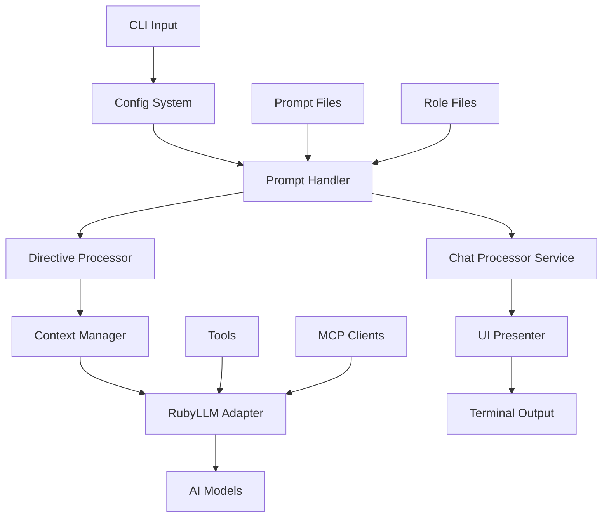

# AIA - AI Assistant

<table border="0">
<tr>
<td width="30%" valign="top">
  
  <div align="center">
      <strong>The Prompt is the Code</strong>
  </div>
</td>
<td width="70%" valign="top">

Welcome to AIA, your powerful CLI tool for dynamic prompt management and AI interaction.
<br/><br/>
<strong>AIA (AI Assistant)</strong> is a Ruby-based command-line tool that revolutionizes how you interact with AI models. It's designed for generative AI workflows, enabling you to effortlessly manage AI prompts, integrate seamlessly with shell and embedded Ruby (ERB), run batch processes, and engage in interactive chats with user-defined directives, tools, and MCP clients.
</td>
</tr>
</table>

  <div align="center">
      AIA treats prompts as executable programs, complete with configuration, logic, and workflows.
  </div>

---

!!! danger "Breaking Changes in v1.0.0 (from v0.11.2)"

    **Version 1.0.0 is a major release with breaking changes. Read this section before upgrading.**

!!! failure "Prompt File Format (Critical)"

    The prompt file format has changed completely. You **must** migrate your prompts.

    - **File extension** — `.txt` is now `.md`
    - **Parameters** — `[PLACEHOLDER]` is now `<%= placeholder %>`
    - **Metadata** — Separate `.json` history files are now YAML front matter inside the `.md` file
    - **Directive embedding** — `//config`, `//pipeline`, etc. are now YAML front matter keys

    **Before (v0.11.2):**

        # ~/.prompts/my_prompt.txt
        //config temperature 0.7
        //pipeline next_prompt, another_prompt
        Tell me about [TOPIC] in [LANGUAGE]

    **After (v1.0.0):**

        ---
        temperature: 0.7
        pipeline: [next_prompt, another_prompt]
        parameters:
          topic: null
          language: null
        ---
        Tell me about <%= topic %> in <%= language %>

    **Run the migration tool:**

        # Back up first (recommended)
        cp -r ~/.prompts ~/.prompts.backup

        # Migrate all prompts
        migrate_prompts --verbose ~/.prompts

        # Review flagged files (*.txt-review), then recover them
        migrate_prompts --reprocess ~/.prompts

    The `migrate_prompts` script is a standalone program in `bin/`. It handles placeholder conversion, directive migration, history file merging, and flags files with code fences for manual review. See [Migration Guide](guides/migrate-prompts.md) for details.

!!! warning "Removed and Deprecated CLI Options"

    - **`--adapter` removed** — AIA now exclusively uses `ruby_llm`. Remove `--adapter` from any scripts or aliases.
    - **`--regex` deprecated** — Parameter extraction uses ERB (`<%= param %>`) instead of regex. The flag prints a warning and has no effect.
    - **`--terse` deprecated** — No longer supported. The flag prints a warning and has no effect.
    - **`--metrics` renamed to `--tokens`** — Use `--tokens` to display token usage. `--cost` implies `--tokens`.

!!! warning "Dependency: prompt_manager v0.5 to v1.0"

    The `prompt_manager` gem has been upgraded from `~> 0.5.8` to `~> 1.0`. This is the root cause of the prompt file format changes above. The new version uses ERB for parameter interpolation and YAML front matter for metadata. All prompt files must be in the new format.

!!! info "Environment Variables (from v0.10.0)"

    If upgrading from v0.9.x, environment variable names changed in v0.10.0 to use double underscore (`__`) for nested config sections:

    | Old (v0.9.x) | New (v1.0.0) |
    |---|---|
    | `AIA_PROMPTS_DIR` | `AIA_PROMPTS__DIR` |
    | `AIA_OUT_FILE` | `AIA_OUTPUT__FILE` |
    | `AIA_VERBOSE` | `AIA_FLAGS__VERBOSE` |
    | `AIA_DEBUG` | `AIA_FLAGS__DEBUG` |
    | `AIA_CHAT` | `AIA_FLAGS__CHAT` |
    | `AIA_TEMPERATURE` | `AIA_LLM__TEMPERATURE` |
    | `AIA_MARKDOWN` | `AIA_OUTPUT__MARKDOWN` |

    `AIA_MODEL` is unchanged. See [Environment Variables](configuration.md#environment-variables) for the complete list.

!!! info "Configuration Files (from v0.10.0)"

    If upgrading from v0.9.x, configuration files now use a nested YAML structure with sections (`llm:`, `prompts:`, `output:`, `flags:`, etc.) and follow the XDG Base Directory Specification (`~/.config/aia/aia.yml`). See [Configuration Guide](configuration.md) for details.

---

## Key Features

### 🚀 Dynamic Prompt Management
- **Hierarchical Configuration**: Embedded directives > CLI args > environment variables > config files > defaults
- **Prompt Sequences and Workflows**: Chain prompts together for complex AI workflows
- **Role-based Prompts**: Use predefined roles to context your AI interactions
- **Fuzzy Search**: Find prompts quickly with fuzzy matching (requires `fzf`)

### 🔧 Powerful Integration
- **Shell Integration**: Execute shell commands directly within prompts
- **Ruby (ERB) Processing**: Use Ruby code in your prompts for dynamic content
- **RubyLLM::Tool Support**: Function callbacks for enhanced AI capabilities
- **MCP Client Support**: Integrate with Model Context Protocol clients

### 💬 Interactive Chat Sessions
- **Context Management**: Maintain conversation history and context
- **Multi-model Support**: Use multiple AI models simultaneously
- **Consensus Mode**: Get consensus responses from multiple models
- **Voice Support**: Convert text to speech and back

### 🎯 Advanced Features
- **Executable Prompts**: Run prompts as executable scripts
- **ERB Parameters**: Use embedded Ruby for dynamic prompt parameters
- **Image Generation**: Generate images with customizable parameters
- **Tool Integration**: Use custom Ruby tools for enhanced functionality

## Quick Start

1. **Install AIA:**
   ```bash
   gem install aia
   ```

2. **Install dependencies:**
   ```bash
   brew install fzf
   ```

3. **Create your first prompt:**
   ```bash
   mkdir -p ~/.prompts
   cat > ~/.prompts/what_is.md << 'EOF'
   ---
   parameters:
     topic: null
   ---
   What is <%= topic %>?
   EOF
   ```

4. **Run your prompt:**
   ```bash
   aia what_is
   ```
   You'll be prompted to enter a value for `topic`, then AIA will send your question to the AI model.

5. **Start an interactive chat:**
   ```bash
   aia --chat

   # Or use multiple models for comparison
   aia --chat --model "gpt-4o-mini,gpt-3.5-turbo"
   ```

When AIA starts, you'll see the friendly robot mascot:

```plain

       ,      ,
       (\____/) AI Assistant (v1.0.0) is Online
        (_oo_)   ["gpt-4o-mini", "claude-sonnet-4-20250514"]
         (O)       using ruby_llm
       __||__    \) model db was last refreshed on
     [/______\]  /    2026-02-04
    / \__AI__/ \/      You can share my tools
   /    /__\
  (\   /____\

```

## Core Architecture

AIA follows a modular Ruby gem structure with clear separation of concerns:

### Component Overview



### Core Components

- **AIA::Config** - Configuration management with hierarchical precedence
- **AIA::PromptHandler** - Main prompt processing orchestrator
- **AIA::ChatProcessorService** - Interactive chat session management
- **AIA::DirectiveProcessor** - Processes embedded directives (`/command params`)
- **AIA::RubyLLMAdapter** - Interfaces with the ruby_llm gem for AI model communication (manages conversation history via RubyLLM's Chat.@messages)
- **AIA::ShellCommandExecutor** - Executes shell commands safely within prompts
- **AIA::HistoryManager** - Manages prompt parameter history and user input
- **AIA::UIPresenter** - Terminal output formatting and presentation
- **AIA::Session** - Manages chat sessions and state
- **AIA::Fzf** - Fuzzy finder integration for prompt selection
- **AIA::Directives::Checkpoint** - Manages conversation checkpoints, restore, clear, and review operations

### External Dependencies

- **prompt_manager gem** - Core prompt management functionality
- **ruby_llm gem** - AI model interface layer
- **fzf** - Command-line fuzzy finder (external CLI tool)

## Documentation Structure

### Getting Started
- [Installation](installation.md) - Get AIA up and running
- [Configuration](configuration.md) - Configure AIA for your needs
- [Getting Started Guide](guides/getting-started.md) - Your first steps with AIA

### Guides
- [Chat Mode](guides/chat.md) - Interactive conversations with AI
- [Working with Models](guides/models.md) - Multi-model support and configuration
- [Tools Integration](guides/tools.md) - Extend AIA with custom tools
- [Advanced Prompting](advanced-prompting.md) - Master complex prompt techniques

### Reference
- [CLI Parameters](cli-reference.md) - Complete command-line reference
- [Directives Reference](directives-reference.md) - All available directives
- [Examples](examples/index.md) - Practical examples and use cases

## Community & Support

- **GitHub**: [madbomber/aia](https://github.com/MadBomber/aia)
- **Issues**: [Report bugs and request features](https://github.com/MadBomber/aia/issues)
- **RubyGems**: [aia gem](https://rubygems.org/gems/aia)

## License

AIA is open source software. See the [LICENSE](https://github.com/MadBomber/aia/blob/main/LICENSE) file for details.

---

Ready to get started? Head to the [Installation](installation.md) guide to begin your AIA journey!
