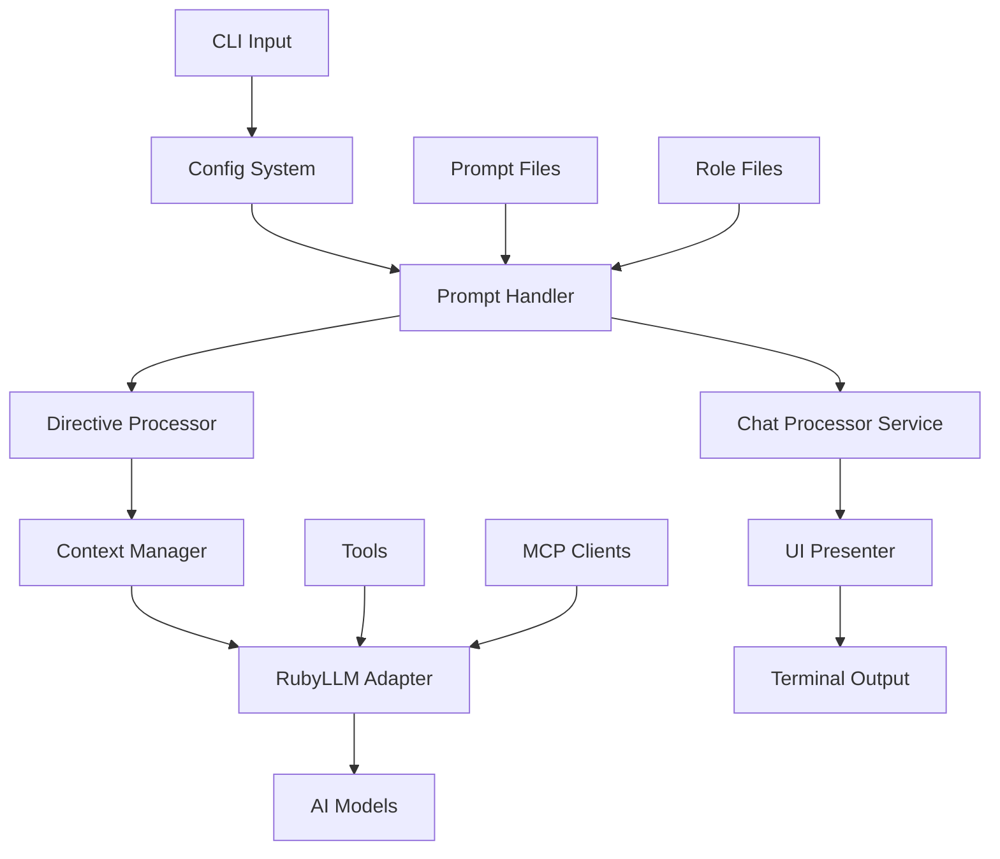

<!-- Tocer[start]: Auto-generated, don't remove. -->

## Table of Contents

- [AIA - AI Assistant](#aia---ai-assistant)
  - [Key Features](#key-features)
    - [🚀 Dynamic Prompt Management](#-dynamic-prompt-management)
    - [🔧 Powerful Integration](#-powerful-integration)
    - [💬 Interactive Chat Sessions](#-interactive-chat-sessions)
    - [🎯 Advanced Features](#-advanced-features)
  - [Quick Start](#quick-start)
  - [Core Architecture](#core-architecture)
    - [Component Overview](#component-overview)
    - [Core Components](#core-components)
    - [External Dependencies](#external-dependencies)
  - [Documentation Structure](#documentation-structure)
    - [Getting Started](#getting-started)
    - [Guides](#guides)
    - [Reference](#reference)
  - [Community & Support](#community--support)
  - [License](#license)

<!-- Tocer[finish]: Auto-generated, don't remove. -->

# AIA - AI Assistant

<table border="0">
<tr>
<td width="30%" valign="top">
  
  <div align="center">
      <strong>The Prompt is the Code</strong>
  </div>
</td>
<td width="70%" valign="top">

Welcome to AIA, your powerful CLI tool for dynamic prompt management and AI interaction.
<br/><br/>
<strong>AIA (AI Assistant)</strong> is a Ruby-based command-line tool that revolutionizes how you interact with AI models. It's designed for generative AI workflows, enabling you to effortlessly manage AI prompts, integrate seamlessly with shell and embedded Ruby (ERB), run batch processes, and engage in interactive chats with user-defined directives, tools, and MCP clients.
</td>
</tr>
</table>

  <div align="center">
      AIA treats prompts as executable programs, complete with configuration, logic, and workflows.
  </div>

---

!!! tip "🚀 New: AI Assistant Scheduler (AIAS)"

    **Schedule and automate your AIA prompts!** AIAS is a new Ruby gem that lets you run AIA prompts on a cron-like schedule — perfect for recurring AI tasks, automated reports, and timed workflows.

    **[View AIAS on GitHub →](https://github.com/madbomber/aias)**

---

!!! tip "🎭 Roles: Give Your Robot a Personality"

    Roles are plain-text prompt files that define how your AI thinks, talks, and interacts with you. Drop one in `~/.prompts/roles/` and your robot instantly becomes someone new.

    **For fun:**
    ```bash
    aia --chat --role pirate           # Arrr, matey!
    aia --chat --role nyc_cabbie       # opinions about EVERYTHING
    aia --chat --role stoned_hacker    # solves it anyway, dude
    ```

    **For serious work:**
    ```bash
    # Explains quantum physics to your 7-year-old
    aia --chat --role first_grade_teacher

    # Three expert robots on the same design doc, simultaneously
    aia --model gpt-4o=architect,claude=security,gemini=performance design.md
    ```

    Assign a different role to each model and get multiple expert perspectives in one command. **[Full Roles Guide →](guides/models.md)**

!!! tip "🎓 Skills: Teach Your Robot Your Process"

    Skills are structured instruction sets that tell your robot *exactly how* to approach a task — your workflow, your standards, every single time. Each skill is a directory with a `SKILL.md` file in `~/.prompts/skills/`.

    ```bash
    aia -s code-quality my_prompt                      # one skill
    aia -s code-quality,security-review my_prompt      # stack them
    aia --chat --role senior_dev -s code-quality       # role + skill
    /skill code-quality                                # add mid-chat
    ```

    Combine roles and skills: a pirate who follows your code review process, a first-grade teacher who uses your step-by-step explanation method, or multiple robots each with their own role and skill set — all from the command line. **[Full Skills Guide →](directives-reference.md)**

---

## Key Features

### 🚀 Dynamic Prompt Management
- **Hierarchical Configuration**: Embedded directives > CLI args > environment variables > config files > defaults
- **Prompt Sequences and Workflows**: Chain prompts together for complex AI workflows
- **Fuzzy Search**: Find prompts quickly with fuzzy matching (requires `fzf`)

### 🎭 Roles & 🎓 Skills
- **Robot Personalities**: Give any robot a voice — fun personas like a pirate or NYC cabbie, or professional ones like a senior architect or first-grade teacher
- **Per-Model Roles**: Assign a different role to each model in a multi-model session — `--model gpt-4o=architect,claude=security`
- **Reusable Skill Sets**: Encode your exact workflow once in a `SKILL.md` file; apply it to any prompt with `-s skill-name`
- **Role + Skill Combos**: A robot can be *who you want* (role) and *know exactly what to do* (skill) simultaneously
- **Mid-Chat Skills**: Add a skill to a running chat session with `/skill skill-name`

### 🔧 Powerful Integration
- **Shell Integration**: Execute shell commands directly within prompts
- **Ruby (ERB) Processing**: Use Ruby code in your prompts for dynamic content
- **RubyLLM::Tool Support**: Function callbacks for enhanced AI capabilities
- **MCP Client Support**: Integrate with Model Context Protocol clients

### 💬 Interactive Chat Sessions
- **Context Management**: Maintain conversation history and context
- **Multi-model Support**: Use multiple AI models simultaneously
- **Consensus Mode**: Get consensus responses from multiple models
- **Voice Support**: Convert text to speech and back

### 🎯 Advanced Features
- **Executable Prompts**: Run prompts as executable scripts
- **ERB Parameters**: Use embedded Ruby for dynamic prompt parameters
- **Image Generation**: Generate images with customizable parameters
- **Tool Integration**: Use custom Ruby tools for enhanced functionality

## Quick Start

1. **Install AIA:**
   ```bash
   gem install aia
   ```

2. **Install dependencies:**
   ```bash
   brew install fzf
   ```

3. **Create your first prompt:**
   ```bash
   mkdir -p ~/.prompts
   cat > ~/.prompts/what_is.md << 'EOF'
   ---
   parameters:
     topic: null
   ---
   What is <%= topic %>?
   EOF
   ```

4. **Run your prompt:**
   ```bash
   aia what_is
   ```
   You'll be prompted to enter a value for `topic`, then AIA will send your question to the AI model.

5. **Start an interactive chat:**
   ```bash
   aia --chat

   # Or use multiple models for comparison
   aia --chat --model "gpt-4o-mini,gpt-3.5-turbo"
   ```

When AIA starts, you'll see the friendly robot mascot:

```plain

       ,      ,
       (\____/) AI Assistant (v1.0.0) is Online
        (_oo_)   ["gpt-4o-mini", "claude-sonnet-4-20250514"]
         (O)       using ruby_llm
       __||__    \) model db was last refreshed on
     [/______\]  /    2026-02-04
    / \__AI__/ \/      You can share my tools
   /    /__\
  (\   /____\

```

## Core Architecture

AIA follows a modular Ruby gem structure with clear separation of concerns:

### Component Overview


```mermaid
graph TD
    A[CLI Input] --> B[Config System]
    B --> C[Prompt Handler]
    C --> D[Directive Processor]
    D --> E[Context Manager]
    E --> F[RubyLLM Adapter]
    F --> G[AI Models]

    H[Prompt Files] --> C
    I[Role Files] --> C
    J[Tools] --> F
    K[MCP Clients] --> F

    C --> L[Chat Processor Service]
    L --> M[UI Presenter]
    M --> N[Terminal Output]
```

### Core Components

- **AIA::Config** - Configuration management with hierarchical precedence
- **AIA::PromptHandler** - Main prompt processing orchestrator
- **AIA::ChatProcessorService** - Interactive chat session management
- **AIA::DirectiveProcessor** - Processes embedded directives (`/command params`)
- **AIA::RubyLLMAdapter** - Replaced in v2 by `RobotFactory` which builds `RobotLab::Robot` or `RobotLab::Network` instances powered by the `robot_lab` gem.
- **AIA::RobotFactory** - Builds `RobotLab::Robot` or `RobotLab::Network` instances; the primary AI execution backend in v2
- **AIA::ShellCommandExecutor** - Executes shell commands safely within prompts
- **AIA::HistoryManager** - Manages prompt parameter history and user input
- **AIA::UIPresenter** - Terminal output formatting and presentation
- **AIA::Session** - Manages chat sessions and state
- **AIA::Fzf** - Fuzzy finder integration for prompt selection
- **AIA::Directives::Checkpoint** - Manages conversation checkpoints, restore, clear, and review operations

### External Dependencies

- **prompt_manager gem** - Core prompt management functionality
- **robot_lab gem** - Robot/network execution engine (replaces direct ruby_llm usage in v2)
- **ruby_llm gem** - AI model interface layer (used internally by robot_lab)
- **fzf** - Command-line fuzzy finder (external CLI tool)

## Documentation Structure

### Getting Started
- [Installation](installation.md) - Get AIA up and running
- [Configuration](configuration.md) - Configure AIA for your needs
- [Getting Started Guide](guides/getting-started.md) - Your first steps with AIA

### Guides
- [Chat Mode](guides/chat.md) - Interactive conversations with AI
- [Working with Models](guides/models.md) - Multi-model support and configuration
- [Tools Integration](guides/tools.md) - Extend AIA with custom tools
- [Advanced Prompting](advanced-prompting.md) - Master complex prompt techniques

### Reference
- [CLI Parameters](cli-reference.md) - Complete command-line reference
- [Directives Reference](directives-reference.md) - All available directives
- [Examples](examples/index.md) - Practical examples and use cases

## Community & Support

- **GitHub**: [madbomber/aia](https://github.com/MadBomber/aia)
- **Issues**: [Report bugs and request features](https://github.com/MadBomber/aia/issues)
- **RubyGems**: [aia gem](https://rubygems.org/gems/aia)

## License

AIA is open source software. See the [LICENSE](https://github.com/MadBomber/aia/blob/main/LICENSE) file for details.

---

Ready to get started? Head to the [Installation](installation.md) guide to begin your AIA journey!
